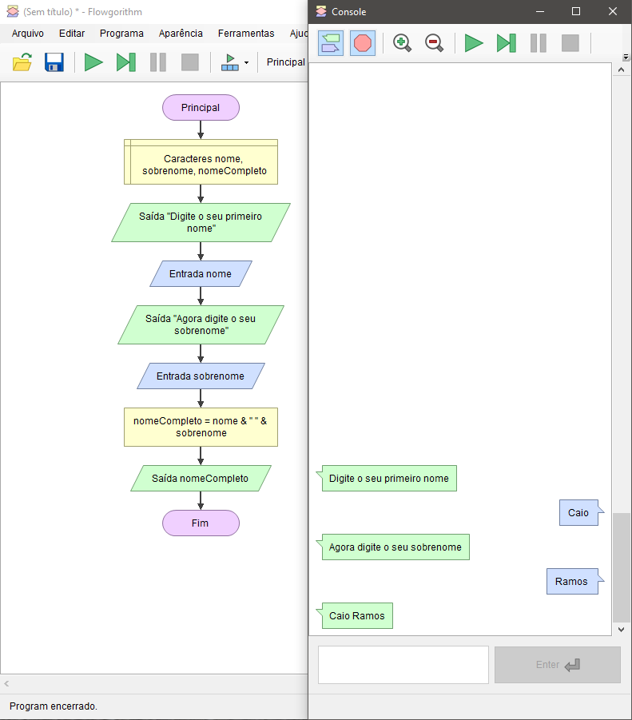

# Concatenação - Demonstração

Você precisa solicitar ao usuário que ele digite o primeiro e o últmo nome, após isso, deve apresentar como resultado o nome completo.

    

Repare que entre a concatenação das variáveis `nome` e `sobrenome` foi adicionado `& " " &`.  
Se fizermos apenas o `nome & sobrenome` o resultado será `caioramos`, por que isso acontece? Por que apenas juntamos as duas variáveis, sem acrescentar um espaço em branco entre elas.