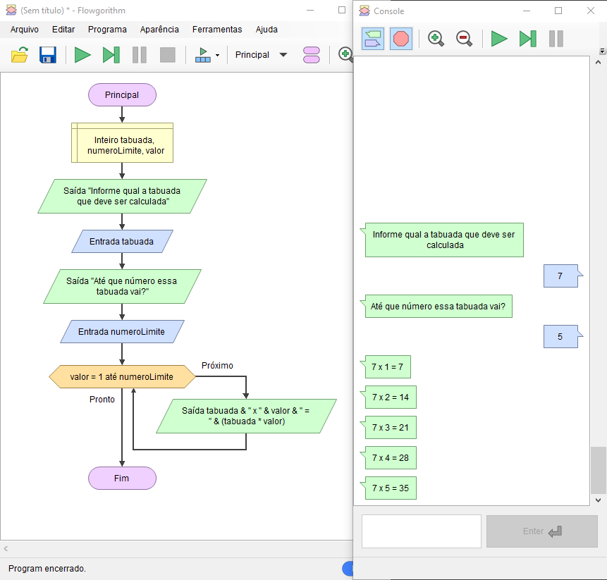

# Para (for) - Demonstração

Imagine que o seu sistema precise imprimir uma tabuada, o usuário deve digitar qual tabuada ele quer ver e até que número ele deseja que essa tabuada seja calculada, porém deve iniciar sempre em 1.

    

