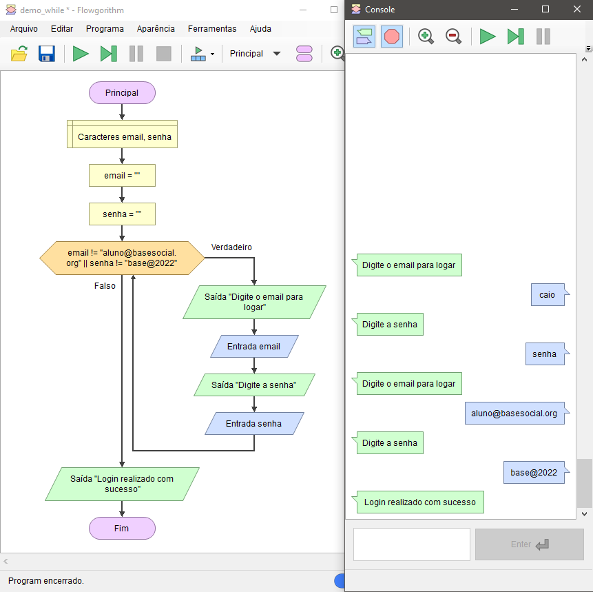

# Enquanto (while) - Demonstração

Imagine que o seu sistema de login fique solicitando infinitamente o e-mail e a senha enquanto o usuário não acertar.

    

**Observação**: As variáveis `email` e `senha` foram inicializadas com texto vazio (`""`) logo no começo, pois dará erro ao tentar usar variáveis que nunca receberam valor no `while` ou em qualquer outra estrutura.