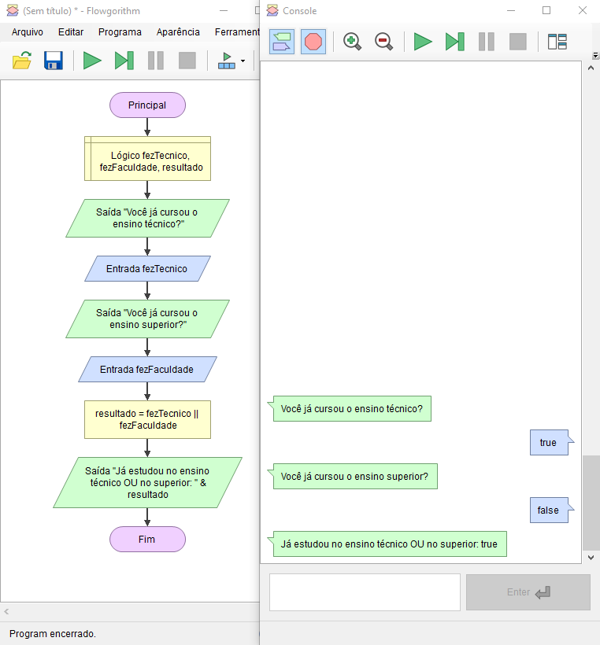

# Operadores Lógicos - Demonstração

Imagine que no seu sistema você precisa saber se o usuário que está tentando se cadastrar já fez estudou no Ensino Técnico ou no Ensino Superior.

**Qualquer uma das informações sendo verdade o sistema deve prosseguir**.

    

Na demonstração acima não está o código completo, pois ainda não aprendemos estruturas condicionais, porém podemos ver que o resultado da nossa validação foi positivo.