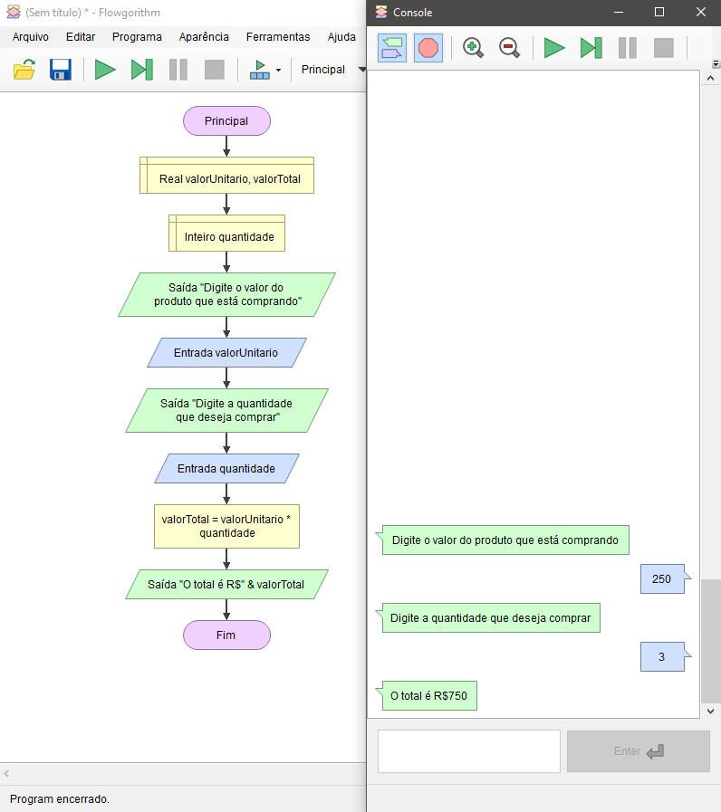

# Operadores Matemáticos - Demonstração

Você está fazendo um sistema para uma loja e os clientes precisam informar o preço do produto que estão comprando e a quantidade, após isso o sistema deve informar o valor total.

    

