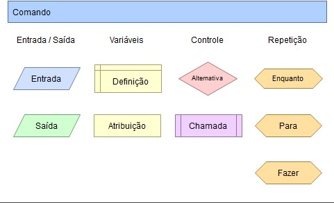
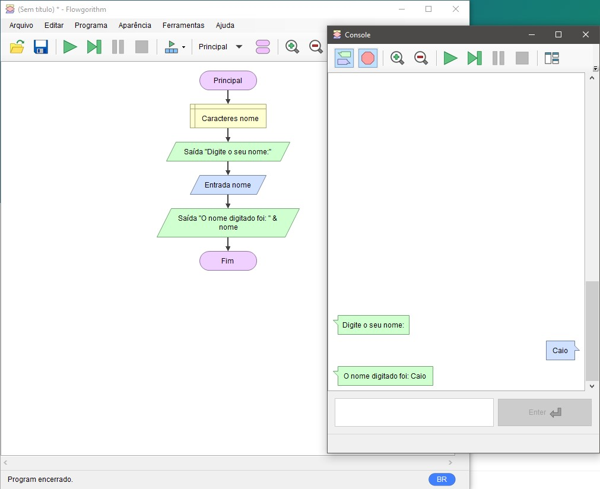

# Lógica de Programação

É similar a uma receita de bolo, ou qualquer receita na verdade, precisamos seguir os passos em uma ordem que faça sentido para alcançar o objetivo. Existem casos em que mudar a ordem dos passos realmente não tem muito impacto, é o famoso caso de *"a ordem dos tratores não altera o viaduto"*, no entanto seria bastante engraçado se ao fazermos um bolo, tentarmos colocar a massa do bolo na forma e depois tentar untá-la, simplesmente não dará certo.

## Tabela de conteúdos

* [Termos Importantes](#termos-importantes)
    * [Instruções](#instruções)
    * [Sequências Lógicas](#sequências-lógicas)
    * [Algoritmos](#algoritmos)
* [Por que Lógica de Programação é Importante?](#por-que-lógica-de-programação-é-importante)
* [Fluxograma](#fluxograma)
    * [Objetos que normalmente compõem um fluxograma](#objetos-que-normalmente-compõem-um-fluxograma)
    * [Para as nossas aulas](#para-as-nossas-aulas)
* [Variáveis](#variáveis)
    * [Composição de uma variável](#composição-de-uma-variável)
    * [Momentos importantes](#momentos-importantes)
    * [Regras de nomenclatura](#regras-de-nomenclatura)
* [Tipos de dados](#tipos-de-dados)
    * [Número](#número)
    * [Texto](#texto)
    * [Lógico ou Booleano](#lógico-ou-booleano)
    * [Data e Hora](#data-e-hora)
* [Concatenação](#concatenação)
* [Operadores Matemáticos](#operadores-matemáticos)
* [Operadores Relacionais](#operadores-relacionais)
* [Operadores Lógicos](#operadores-lógicos)
    * [E](#e)
    * [OU](#ou)
* [Condicionais](#condicionais)
    * [Se](#se)
    * [Senão](#senão)
* [Loops](#loops)
    * [Para](#para)
    * [Enquanto](#enquanto)
    * [Faça enquanto](#faça-enquanto)

---

## Termos importantes

### Instruções
Nada mais são que ações que nosso programa executará.

### Sequências Lógicas
A sequência que faz sentido para que as instruções ou ações sejam executadas.

### Algoritmos
É uma sequência de instruções ou ações com o objetivo de fazer algo, com começo, meio e fim. Lembra da receita que falamos acima?

Recentemente ficaram bem famosos fora do mundo da programação graças às pessoas reclamando deles, aposto que vcs já ouviram algo como:
>"Não esquece de curtir o vídeo e seguir o canal, assim o ALGORITMO do youtube..."

Ou até mesmo:
>"... o ALGORITMO do Instagram diminuiu o meu alcance..."

---

## Por que Lógica de Programação é Importante?
- Porque nos ajuda a aprimorar o nosso modo de pensar!
- Porque é independente de linguagem de programação!
- Porque é útil em qualquer área de qualquer negócio!

>"Everybody in this country should learn how to program a computer because it teaches you how to think.” Steve Jobs

---

## Fluxograma

É uma maneira visual e simplificada de representar um processo, um fluxo de trabalho, uma ideia ou um algoritmo.

Como a ideia do fluxograma é ser totalmente visual, são utilizadas diferentes estruturas e cada uma delas tem uma função, para que ao bater o olho seja fácil de entender o que está acontecendo.

### Objetos que normalmente compõem um fluxograma

* **Entrada** - utilizado para receber valores digitados pelo usuário;
* **Saída** - utilizado para mostrar mensagens ao usuário;
* **Definição** - local para criação das variáveis;
* **Atribuição** - local onde as variáveis receberão valores e operações matemáticas serão feitas;
* **Alternativa** - bloco para estrutura condicional;
* **Chamada** - bloco para utilização de funções;
* **Enquanto**, **Para** e **Fazer** - blocos para estruturas de repetição.

**Observação**: A imagem acima mostra as estruturas existentes no programa que utilizaremos em aula, porém, dependendo das ferramentas utilizadas os objetos que compõem um fluxograma podem ser um pouco diferentes.

### Para as nossas aulas
Utilizaremos um software chamado [Flowgorithm](http://www.flowgorithm.org/index.html). Sua instalação é bastante simples e direta.

Abaixo, uma imagem que mostra o Flowgorithm em funcionamento. Na janela maior temos a "escrita" do nosso programa e na menor temos ele sendo executado:

---

## Variáveis
O conceito é bastante similar ao de variáveis na Matemática. Simboliza um valor, que você ainda não sabe qual é, mas que pode ser utilizado para contas ou outras operações.  

Por exemplo: `f(x) = 3x + 1`  

No exemplo acima **x** é uma variável numérica e que se atribuirmos um valor para ela, podemos facilmente resolver a 
equação.  

Se `x = 3`, então `f(3) = 3 * 3 + 1`, logo `f(3) = 10`

### Composição de uma variável
Na programação, variáveis são compostas de modo geral por 3 partes importantes:
1. **Tipo** - determina se variável armazenará valores numéricos, textuais, datas, etc
2. **Nome** - identificação da variável, assim como o **x** ou **y** que normalmente usamos na matemática
3. **Valor** - o valor que será guardado, precisa ter o tipo certo

### Momentos importantes
Para trabalhar com variáveis, precisamos respeitar alguns momentos necessários:
1. **Declaração** ou **Definição** - momento onde a variável é criada, a partir da declaração a sua variável passa a existir. É o passo onde informamos 2 das 3 partes necessárias para uma variável, o tipo e o nome.  
Ex: `texto nomeEstudante` (variável `nomeEstudante` do tipo `texto`) ou `número idadeEstudante` (variável `idadeEstudante` do tipo `número`)
2. **Atribuição** - momento onde atribuímos um valor para a variável.  
Importante: só conseguimos atribuir valores para variáveis que já foram declaradas!  
Ex: `nomeEstudante = “Caio”` ou `idadeEstudante = 21`

### Regras de nomenclatura
- não são permitidos espaços em branco  
Ex: `texto nome estudante`
- não são permitidos acentos ou caracteres especiais (com exceção do underline `_`)  
Ex: `texto nomePaís`
- não podem começar com números  
Ex: `numero 1mes`

---

## Tipos de dados

### Número
Servem para armazenar apenas números e podem ser utilizadas para fazer contas.  
Algumas linguagens de programação tem tipos específicos de variáveis dependendo do tipo de número, por exemplo:
- números inteiros
- números com casas decimais
- números muito grandes

### Texto
Pode armazenar qualquer coisa, mas tudo será tratado como texto.  
**NÃO** pode fazer contas.  
Todo valor **SEMPRE** precisa estar entre **aspas “”** ou **apóstrofo ‘’**

### Lógico ou Booleano
Para valores de **Positivo** ou **Negativo**.  
Ideal para comparações e informações que tem apenas 2 resultados possíveis.

### Data e Hora
Algumas linguagens tem tipos de dados específicos para Data, Hora ou até mesmo um tipo só pra ambos.

---

## Concatenação
É a operação de juntar ou "somar" textos.
Dependendo da linguagem ou ferramenta pode ser representada pelo sinal `+` ou `&` *(esse é o modo de fazer no Flowgorithm)*.

Exemplo: Imagine que no seu código exista uma variável `nome = "caio"` e outra `sobrenome = "ramos"`, como resultado você quer apresentar o nome completo, uma possibilidade seria: 
* `nomeCompleto = nome + sobrenome` ou
* `nomeCompleto = nome & sobrenome` *(esse é o modo de fazer no Flowgorithm)*

Porém para ambos os casos, o resultado será `caioramos`, por que isso acontece? Por que apenas juntamos as duas variáveis, sem acrescentar um espaço em branco entre elas, o mais correto seria:
* `nomeCompleto = nome + " " + sobrenome` ou
* `nomeCompleto = nome & " " & sobrenome` *(esse é o modo de fazer no Flowgorithm)*

Assim, o resultado será `caio ramos`.

## Operadores Matemáticos
Servem para realizar operações matemáticas com **valores numéricos** ou **variáveis numéricas**, praticamente da mesma forma em que usamos nas calculadoras.

- Soma `+`  
- Subtração `-`  
- Multiplicação `*`  
- Divisão `/`  
- Mod (resto de uma divisão) `%`

Outras operações não listadas aqui como potenciação e radiciação também existem, entretanto seu símbolo ou forma de excecutar depende de cada linguagem de programação.

--- 

## Operadores Relacionais
São utilizados para realizar comparações entre **duas** variáveis ou valores.  
**Importante**: O retorno de uma operação relacional é sempre um `valor booleano`, ou seja `verdadeiro` ou `falso` (`sim` ou `não`).

- Igual `==`  
- Diferente `!=`  
- Maior `>`  
- Maior ou igual `>=`  
- Menor `<`  
- Menor ou igual `<=`  

--- 

## Operadores Lógicos

### E `(&&)`
Utilizado quando você quer usar mais do que uma comparação ao mesmo tempo e você quer que todas as partes da sua comparação sejam verdade para prosseguir.

Por exemplo: para participar da aula online eu preciso que o **computador esteja ligado** `E` **tenha internet**.  
Se alguma das condições falhar eu não conseguirei assistir a aula online.

Tabela da verdade para o `E (&&)`:

| Comparação 1 |    | Comparação 2 | Resultado  |
|--------------|----|--------------|------------|
| Verdadeiro   | && | Verdadeiro   | Verdadeiro |
| Verdadeiro   | && | Falso        | Falso      |
| Falso        | && | Verdadeiro   | Falso      |
| Falso        | && | Falso        | Falso      |

### OU `(||)`
Utilizado quando você quer usar mais do que uma comparação ao mesmo tempo e você quer que alguma das partes da sua comparação seja verdade para prosseguir.

Por exemplo: para participar da aula online eu preciso estar **conectado no wifi** `OU` **conectado no 4g**.  
Se alguma das condições funcionar, eu já consigo assistir a aula online.

Tabela da verdade para o `OU (||)`:

| Comparação 1 |      | Comparação 2 | Resultado  |
|--------------|------|--------------|------------|
| Verdadeiro   | \|\| | Verdadeiro   | Verdadeiro |
| Verdadeiro   | \|\| | Falso        | Verdadeiro |
| Falso        | \|\| | Verdadeiro   | Verdadeiro |
| Falso        | \|\| | Falso        | Falso      |

---

## Condicionais

### Se
...

### Senão 
...

---

## Loops
Loops são estruturas de repetição e servem para algoritmos onde precisamos executar um mesmo bloco de código diversas vezes.

Imagine que você está programando um jogo de tabuleiro, daqueles que o jogador precisa avançar todas as casas até o fim para ganhar. Toda vez que uma pessoa joga um dado, o personagem desta pessoa precisa andar a quantidade de casas igual ao valor obtido no dado.

Se você tem um comando para andar uma casa, por exemplo, e o valor obtido no dado for 6, você precisará escrever esse comando 6 vezes para que o personagem ande todas as casas.

Usando um comando de Loop, podemos automatizar essas execuções e repetir quantas vezes for necessário sem necessariamente precisar escrever um mesmo código várias vezes

Quando precisamos executar um mesmo trecho de código diversas vezes e decidimos recorrer aos Loops, podemos escolher entre dois tipos:

1. O primeiro tipo é quando **sabemos exatamente quantas vezes vamos precisar repetir**, assim como no exemplo do jogo de tabuleiro, o número que sair no dado é o número de vezes que teremos que repetir uma ação.
2. O segundo tipo é quando **NÃO sabemos exatamente quantas vezes vamos precisar repetir** um comando, no entanto **sabemos uma condição que pode fazê-lo terminar**.

Vamos detalhar um pouco mais cada um deles na sequência.

### Para
O bloco de comando `FOR` é utilizado quando sabemos exatamente quantas vezes uma determinada ação precisa ser executada.

Este comando normalmente tem a seguinte estrutura:
- Uma variável inteira para controlar a quantidade de voltas
- Um valor limite que marca o máximo de voltas
- Como a quantidade de voltas será controlada (de maneira crescente ou decrescente)
- Como as voltas serão contadas (de 1 em 1, de 2 em 2, etc)

Exemplo: Imagine que você está enviando 10 imagens em um grupo do Whatsapp, nesse caso o Whatsapp sabe exatamente quantas vezes ele precisa executar o comando para enviar imagem. Ele começa na primeira e vai enviando de 1 em 1, até concluir as 10 imagens.

### Enquanto
Por outro lado, nem sempre é fácil determinar quantas vezes será necessário executar algo.

Nesses casos, podemos utilizar o `WHILE`, a tradução deste comando em Português é enquanto, ou seja enquanto alguma condição for verdadeira o bloco de comandos em questão será repetido.

Então, para montar esse bloco de comando precisamos de apenas 1 coisa:
- Uma condição que nos diga quando continuar executando e quanto parar.

Exemplo: Se você estiver fazendo uma receita em que precise misturar bem todos os ingredientes, provavelmente uma instrução do tipo “misture 50 vezes” não faz muito sentido, seria muito melhor algo como: ***“misture até ficar homogêneo”*** ou até mesmo ***“misture enquanto conseguir identificar os ingredientes”***

Ao utilizar o `WHILE` precisamos ter cuidado para estabeler bem claramente a condição de finalização, se não corremos o risco de ter uma aplicação rodando pra sempre.

Alguns exemplos de condições que podem fazer uma aplicação rodar pra sempre são:
- `enquanto 1 == 1` ou qualquer outra comparação que sempre será verdade
- `enquanto true`

### Faça enquanto
...