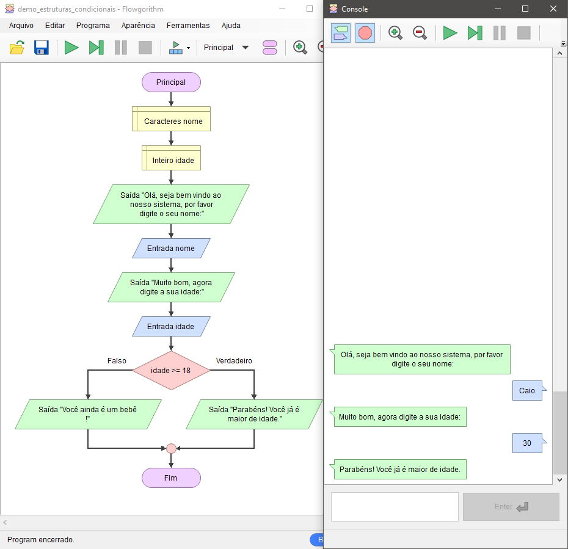

# Estruturas Condicionais - Demonstração

Imagine que no seu sistema você precisa saber se o usuário que está tentando se cadastrar já é maior de idade.

Se o usuário já tiver 18 anos ou mais você deve mostrar uma mensagem, senão, uma mensagem diferente deve ser mostrada.

    

