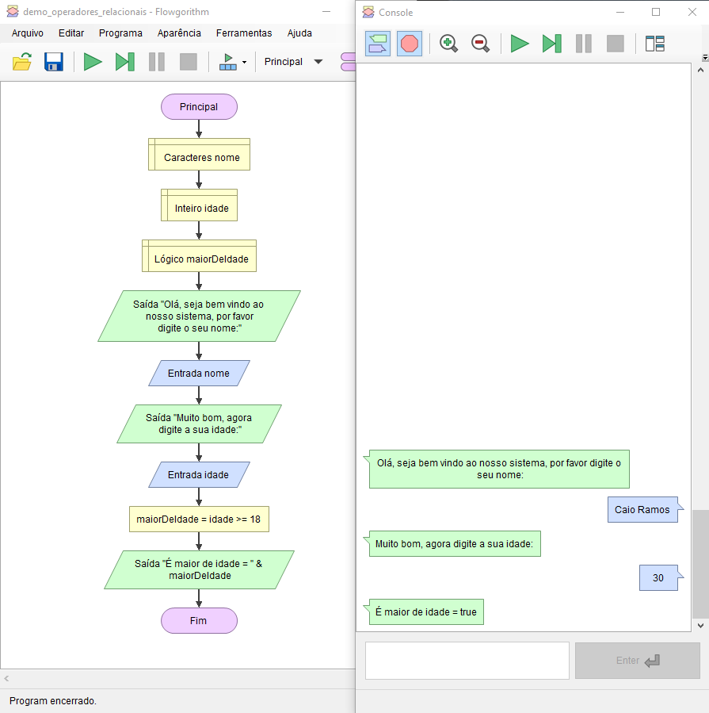

# Operadores Relacionais - Demonstração

Imagine que no seu sistema você precisa saber se o usuário que está tentando se cadastrar já é maior de idade.

Podemos usar o `>=` (maior ou igual) para nos ajudar a entender se o usuário já tem 18 anos ou mais.

    

