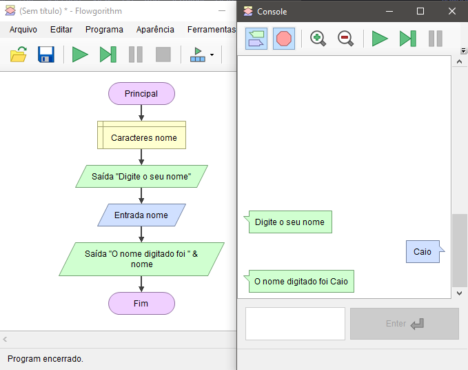

# Fluxograma

É uma maneira visual e simplificada de representar um processo, um fluxo de trabalho, uma ideia ou um algoritmo.

    

Como a ideia do fluxograma é ser totalmente visual, são utilizadas diferentes estruturas e cada uma delas tem uma função, para que ao bater o olho seja fácil de entender o que está acontecendo.

    

### Objetos que normalmente compõem um fluxograma

* **Entrada** - utilizado para receber valores digitados pelo usuário;
* **Saída** - utilizado para mostrar mensagens ao usuário;
* **Definição** - local para criação das variáveis;
* **Atribuição** - local onde as variáveis receberão valores e operações matemáticas serão feitas;
* **Alternativa** - bloco para estrutura condicional;
* **Chamada** - bloco para utilização de funções;
* **Enquanto**, **Para** e **Fazer** - blocos para estruturas de repetição.

    

**Observação**: A imagem acima mostra as estruturas existentes no programa que utilizaremos em aula, porém, dependendo das ferramentas utilizadas os objetos que compõem um fluxograma podem ser um pouco diferentes.

### Para as nossas aulas
Utilizaremos um software chamado [Flowgorithm](http://www.flowgorithm.org/index.html). Sua instalação é bastante simples e direta.

Abaixo, uma imagem que mostra o Flowgorithm em funcionamento. Na janela maior temos a "escrita" do nosso programa e na menor temos ele sendo executado:

    

