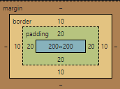
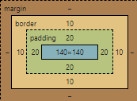
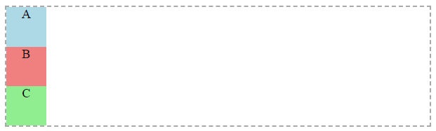
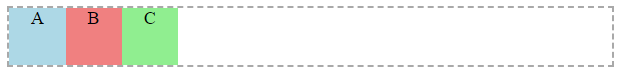
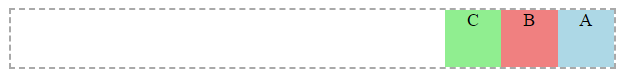
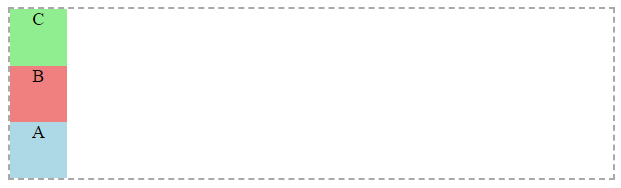
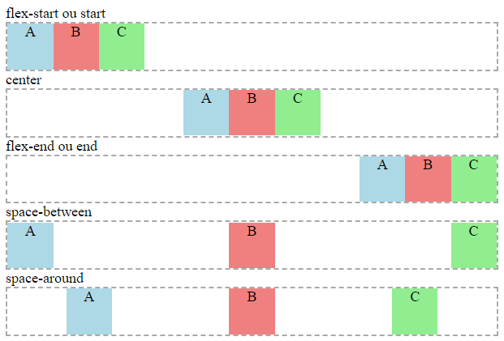
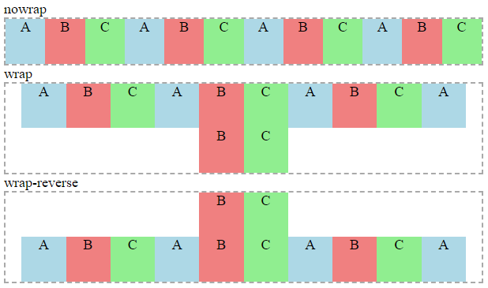
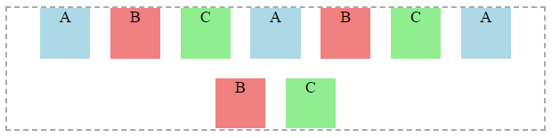
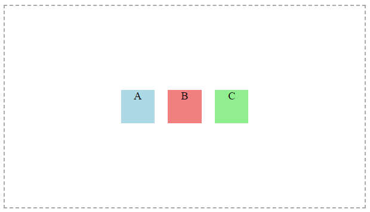

# CSS

O `CSS` (Cascading Style Sheets ou Folhas de Estilo em Cascata) é o responsável pela aparência das nossas páginas ou Sites. É com ele que definimos a nossa identidade visual.

Aproveitando o paralelo com o corpo humano que fizemos no texto sobre `HTML`, o `CSS` seria não apenas a pele, mas também todas roupas, jóias, maquiagem e até mesmo tatuagens que temos no corpo e que pode ou não nos diferenciar dos demais indivíduos.

Assim como o `HTML`, o `CSS` também possui uma sintaxe própria, que por sua vez, é bem diferente da primeira linguagem que estudamos.

## Tabela de conteúdos
* [Formas de usar o CSS](#formas-de-usar-o-css)
  * [Do jeito "feio"](#do-jeito-"feio")
  * [Do jeito "mais ou menos"](#do-jeito-"mais-ou-menos")
  * [Do jeito "certo"](#do-jeito-"certo")
* [Como selecionar elementos para aplicar o estilo?](#como-selecionar-os-elementos-para-aplicar-o-estilo)
  * [Pela tag do elemento](#pela-tag-do-elemento)
  * [Pela classe do elemento](#pela-classe-do-elemento)
  * [Pelo id do elemento](#pelo-id-do-elemento)
* [Múltiplas formas de seleção](#múltiplas-formas-de-seleção)
  * [Aplicar o mesmo estilo a elementos diferentes](#aplicar-o-mesmo-estilo-a-elementos-diferentes)
  * [Selecionar um elemento que está dentro de outro](#selecionar-um-elemento-que-está-dentro-de-outro)
* [Cores](#cores)
  * [Cor do texto](#cor-do-texto)
  * [Cor de fundo](#cor-de-fundo)
* [Textos](#textos)
  * [Fonte](#fonte)
  * [Alinhamento do texto](#alinhamento-do-texto)
* [Áreas e Tamanhos](#areas-e-tamanhos)
  * [Bordas](#bordas)
  * [Largura e altura](#largura-e-altura)
  * [Espaçamento interno](#espaçamento-interno)
  * [Espaçamento externo](#espaçamento-externo)
  * [Box-sizing](#box-sizing)
* [Posicionamento de elementos](#posicionamento-de-elementos)
  * [Utilizando display](#utilizando-display)
  * [Utilizando position](#utilizando-position)
  * [Utilizando Flexbox](#utilizando-flexbox)
* [Pseudo-classes](#pseudo-classes)
  * [hover](#hover)
  * [active](#active)

## Formas de usar o CSS
Podemos criar o `CSS` de 3 formas diferentes para criar as nossas páginas com conteúdo e estilo.

### Do jeito *"feio"*
A primeira forma de trabalhar com o `CSS` e que é considerada a mais *"feia"*, é utilizando a propriedade `style` que todo elemento `HTML` possui.

```html
<p style="color:blue">Um parágrafo qualquer</p>
```

Essa é sem dúvida a forma mais rápida e normalmente aprendemos por aqui, no entanto, o problema com esse modo é que o estilo é criado individualmente para cada elemento e se você tiver 10 elementos como esse na sua página, você precisará replicar esse código nos 10 elemento.

```html
<p style="color:blue">Um parágrafo qualquer</p>
<p style="color:blue">Um parágrafo qualquer</p>
<p style="color:blue">Um parágrafo qualquer</p>
<p style="color:blue">Um parágrafo qualquer</p>
<p style="color:blue">Um parágrafo qualquer</p>
<p style="color:blue">Um parágrafo qualquer</p>
<p style="color:blue">Um parágrafo qualquer</p>
```

Não apenas isso, mas se por algum motivo você precisar alterar o estilo, terá que alterar em todos!

🎥 **Vídeo falando sobre o assunto:**
* [CSS da forma feia](https://www.youtube.com/watch?v=qstZ66Ebz7M&list=PLLvkn_w48B4EvM071BukVsNYvOByRH2t-&index=4)

### Do jeito *"mais ou menos"*
O modo *"mais ou menos"* de trabalhar com o `CSS` busca facilitar o problema que existe no modo anterior, ou seja, aqui não fazemos os estilos de maneira duplicada para cada elemento. 

Nesse modo, tentamos trabalhar de maneira mais genérica, para que o maior número de elementos se beneficie dos estilos criados.

```html
<head>
  ...
  <title>Título da página</title>

  <style>
    p {
      color: blue;
    }
  </style>
</head>
```

Para isso, criamos uma tag `<style>` no cabeçalho da nossa página e lá definimos as modificações que faremos. Essas modificações podem ser aplicadas para todos os elementos da página, dependendo da forma como configurarmos.

Por exemplo, o código acima está aplicando a cor azul para todos os elementos `<p>` da página.  
Repare dentro da tag `<style>` é código `CSS` que está sendo empregado e não mais o `HTML`, justamente por isso não é necessário a utilização de tags `<>` no código.

Você pode estar se perguntando: 
> E por que esse é o modo *"mais ou menos"* se já resolve os problemas apontados anteriormente?

Porque todo estilo criado dentro da tag `style` pode ser aproveitado apenas por essa página, e um site por mais simples que seja dificilmente terá apenas uma página. Nesse caso, teremos que lidar com duplicações e possivelmente com modificações. 

🎥 **Vídeo falando sobre o assunto:**
* [CSS mais ou menos](https://www.youtube.com/watch?v=qmQ8Y0YqQd0&list=PLLvkn_w48B4EvM071BukVsNYvOByRH2t-&index=5)

### Do jeito ***"certo"***
O melhor modo de trabalhar com o `CSS` é tendo **um arquivo dedicado para isso**. Assim poderemos nos beneficiar de todos os pontos anteriores, teremos estilos aplicados facilmente para todos os elementos da página e ainda poderemos compartilhar esses estilos entre páginas de um mesmo site. Mantendo assim uma identidade visual coerente e mais fácil de gerenciar.

Os arquivos `CSS` tem a extensão `.css` e tem a seguinte estrutura:

```css
p {
  color: blue;
}

img {
  width: 120px;
}

...
```

Como estamos trabalhando com o `CSS` em um arquivo a parte, é necessário informar para o HTML qual o arquivo estamos utilizando para os estilos da nossa página, para isto, basta incluir a tag `<link>` no cabeçalho da nossa página:

```html
<head>
  ...
  <title>Título da página</title>

  <link rel="stylesheet" href="estilo.css">
</head>
```

A propriedade `rel="stylesheet"` é referente ao tipo de link que estamos fazendo, neste caso, com uma folha de estilos.  
Já a propriedade `href="estilo.css"` é onde estamos informando qual o arquivo de estilo que queremos utilizar na nossa página (é necessário informar o nome do arquivo e a extensão).

**Importante**: podemos linkar quantos arquivos CSS forem necessários em nossas páginas! Porém, precisamos ter cuidado para que os mesmos elementos não estejam sendo modificado nos diversos arquivos, pois isso pode ocasionar efeitos coloterais difíceis de rastrear.

🎥 **Vídeo falando sobre o assunto:**
* [CSS do jeito certo](https://www.youtube.com/watch?v=lmkCqZcaKfI&list=PLLvkn_w48B4EvM071BukVsNYvOByRH2t-&index=6)

## Como selecionar os elementos para aplicar o estilo?
Considerando que você esteja utilizando o `CSS` do *"jeito certo"* ou até mesmo do jeito *"mais ou menos"*, você tem algumas possibilidades de como selecionar os elementos para aplicação do estilo.

### Pela tag do elemento
Você pode utilizar o nome das tags `HTML` para realizar a aplicação dos estilos.

***Importante***: não é necessário utilizar os sinais de `<` ou `>`.

```css
/* para modificar as cores de todos os parágrafos*/
p {
  color: blue;
}

/* para modificar a largura de todas as imagens */
img {
  width: 120px;
}
```

### Pela classe do elemento
Utilizando a opção acima nós aplicamos os estilos para TODOS os elementos daquele tipo, mas as vezes queremos que apenas alguns elementos sejam modificados, para isso podemos utilizar `classes`.

As classes funcionam como um classificador, agrupando elementos parecidos ou com estilos parecidos. 

Para criar classes, precisamos usar a propriedade `class` nos elementos `HTML`.

Já para aplicar um estilo nessas classes no `CSS`, utilizamos o nome dela iniciando com `ponto(.)`.

```html
<p class="texto-grande-azul">Um texto qualquer...</p>

<p class="texto-grande-azul">Outro texto qualquer...</p>

<p>Outro parágrafo sem nenhuma classe</p>
```
```css
.texto-grande-azul {
  font-size: 30px;
  color: blue;
}
```

Cada elemento `HTML` pode ter infinitas classes, nesse caso, elas devem estar dento da mesma propriedade `class` e separadas por espaço. No exemplo abaixo, o parágrafo possui 3 classes:

```html
<p class="texto-grande-azul titulo texto-em-negrito">Um texto qualquer...</p>
```

### Pelo id do elemento
Outra forma de aplicar estilos a elementos é pelo `id`, imagine o `id` do elemento como o nosso `CPF`, um documento único e que cada cidadão tem o seu.

No caso do `HTML`, cada elemento pode ter o seu id e **NÃO** devemos permitir duplicações, para isso basta preenchermos a propriedade `id`.

Já para aplicar um estilo ao `id` no `CSS`, utilizamos o valor dele iniciando com `jogo da velha ou hashtag(#)`.

```html
<p id="mensagem-importante">Um texto qualquer...</p>

<p>Outro parágrafo sem nenhuma classe</p>
```
```css
#mensagem-importante {
  font-size: 30px;
  color: blue;
}
```

## Múltiplas formas de seleção
Todas as formas de seleção mostradas acima podem ser utilizadas em conjunto, seja para selecionar multiplos elementos ao mesmo tempo, ou para selecionar elementos que estao dentro de elementos, por exemplo:

### Aplicar o mesmo estilo a elementos diferentes
Usamos os nomes das tags dos elementos, classes ou ids separados por `vírgula(,)`.
```css
/* aplicando o mesmo estilo para itens de lista, parágrafos e elementos com a classe ".uma-classe-qualquer */
li,p,.uma-classe-qualquer {
  ...
}
```

### Selecionar um elemento que está dentro de outro
Usamos os nomes das tags dos elementos, classes ou ids separados por `espaço( )`.
```css
/* aplicando o estilo para imagens que estejam dentro de divs */
div img {
  ...
}

/* aplicando o estilo para imagens que estejam dentro de elementos com a classe ".uma-classe-qualquer" */
.uma-classe-qualquer img {
  ...
}

/* aplicando o estilo para elementos com a classe ".uma-classe-qualquer" que estejam dentro de divs */
div .uma-classe-qualquer {
  ...
}
```

## Cores
Os exemplos foram todos aplicados a parágrafos apenas para ilustração, no entanto, podem ser aplicados para praticamente todos os elementos `HTML`. 

### Cor do texto
```css
p {
  color: lightblue; 
}
```

### Cor de fundo
```css
p {
  background-color: lightgreen; 
}
```

## Textos
Os exemplos foram todos aplicados a parágrafos apenas para ilustração, no entanto, podem ser aplicados para praticamente todos os elementos `HTML`. 

### Fonte
```css
p {
  font-size: 22px; /* tamanho da fonte */
  font-weight: bold; /* peso da fonte */
  font-style: italic; /* estilo da fonte */
  font-family: Arial, Helvetica, sans-serif; /* família da fonte */
}
```

### Alinhamento do texto
Podemos alterar o alinhamento horizontal dos textos.
```css
p {
  text-align: center; /* alinhamento do texto */
}
```

## Áreas e Tamanhos
Os exemplos foram todos aplicados a parágrafos apenas para ilustração, no entanto, podem ser aplicados para praticamente todos os elementos `HTML`. 

### Bordas
Não só é possível adicionar borda em praticamente todos os elementos `HTML`, como também é possível deixa-las de diferentes formas. 

Para isso temos algumas propriedades referentes a borda:

```css
p {
  border-style: solid; /* borda solida, poderia ser pontilhada, etc */
  border-width: 2px; /* largura de 2px */
  border-color: blue; /* cor azul */
  border-radius: 5px; /* arredondamento nos cantos */
}
```

### Largura e Altura
```css
p {
  width: 250px; /* largura */
  height: 100px; /* altura */

  /* borda para auxiliar na visualização*/
  border-style: solid; 
  border-width: 1px; 
}
```

### Espaçamento interno
Considere a ***borda do elemento como um muro***, ***área do elemento como um quintal*** e o ***texto ou conteúdo do elemento como uma casa***, a propriedade `padding` trabalha o espaçamento interno, ou seja o ***espaço entre o muro e a casa***.

```css
p {
  padding-top: 5px; /* espaçamento interno superior */
  padding-left: 10px; /* espaçamento interno esquerdo */
  padding-right: 10px; /* espaçamento interno direito */
  padding-bottom: 5px; /* espaçamento interno inferior */

  /* borda para auxiliar na visualização*/
  border-style: solid;
  border-width: 1px;
}
```

### Espaçamento externo
Seguindo com o mesmo exemplo considere a ***borda do elemento como um muro***, ***área do elemento como um quintal*** e o ***texto ou conteúdo do elemento como uma casa***, a propriedade `margin` trabalha o espaçamento externo, ou seja o ***espaço entre o muro e a rua*** ou qualquer coisa que esteja do lado de fora do muro.

```css
p {
  margin-top: 10px; /* espaçamento externo superior */
  margin-left: 20px; /* espaçamento externo esquerdo */
  margin-right: 20px; /* espaçamento externo direito */
  margin-bottom: 10px; /* espaçamento externo inferior */

  /* borda para auxiliar na visualização*/
  border-style: solid;
  border-width: 1px;
}
```

### Box-sizing
É a propriedade que define se apenas a **área interna** do elemento será contabilizada ou se **bordas** e **espaçamentos internos** também farão parte.

Existem basicamente dois valores possíveis:
```css
box-sizing: content-box;

/* ou */

box-sizing: border-box;
```

`content-box`: é o modo padrão de todo elemento. Apenas a área interna **útil** é contabilizada ao definirmos a largura e altura. Ou seja, não são consideradas bordas nem espaçamentos internos.

`border-box`: já nesse modo, as bordas e o espaçamento interno são contabilizados na área do elemento. Assim, a área útil do elemento será o que sobrar após descontar a borda e o espaçamento interno.

#### Exemplo
Imagine que temos duas `divs` na tela, uma dentro da outra.  
A **div interna** é toda <span style="color:yellow">amarela</span> e tem a largura e a altura de `100%`, ou seja, vai ocupar todo o **espaço útil** do elemento que ela está dentro.  
Já a div externa é toda <span style="color:lightblue">azul claro</span>, tem a largura e altura fixas de `100px`, tem também um espaçamento interno em todos os lados de 20px e uma borda <span style="color:blue">azul</span> de `10px`.

O `CSS` que aplica o que foi descrito ficará assim:

```css
.div-externa {
    width: 100px;
    height: 100px;
    background-color: lightblue;

    border-width: 10px;
    border-color: blue;
    border-style: solid;

    padding: 20px;
}

.div-interna {
    width: 100%;
    height: 100%;

    background-color: yellow;
}
```

E o resultado será:

<div style="display:flex;justify-content:center">
  <div style="width: 100px;height: 100px;background-color: lightblue;border-width: 10px;border-color: blue;border-style: solid;padding: 20px;box-sizing: content-box;">
    <div style="width: 100%;height: 100%;background-color: yellow;">
    </div>
  </div>
</div>

Olhando para o resultado não é possível identificar nada de errado, porém, ao inspecionarmos o elemento pelo navegador temos o seguinte: 

<P align="center">
    
</p>

Podemos notar que a área final da `div` ficou diferente do que definimos inicialmente, pois agora tem:
1. `200px` de largura e altura de área útil
1. `20px` de espaçamento interno em todos os lados
1. `10px` de borda em todos os lados 

Assim, a largura e a altura final são: `200 + (2*20) + (2*10) = 260`

Agora, se utilizarmos a propriedade `box-sizing` com o valor `border-box` o resultado será bem diferente.

```css
.div-externa {
    width: 100px;
    height: 100px;
    background-color: lightblue;

    border-width: 10px;
    border-color: blue;
    border-style: solid;

    padding: 20px;
    box-sizing: border-box;
}

.div-interna {
    width: 100%;
    height: 100%;

    background-color: yellow;}
```

E o resultado será:

<div style="display:flex;justify-content:center">
  <div style="width: 100px;height: 100px;background-color: lightblue;border-width: 10px;border-color: blue;border-style: solid;padding: 20px; box-sizing: border-box;">
    <div style="width: 100%;height: 100%;background-color: yellow;">
    </div>
  </div>
</div>

O resultado já ficou visualmente diferente, mas vamos dar uma olhada no inspetor pra entender o que aconteceu.

<P align="center">
    
</p>

1. `140px` de largura e altura de área útil
1. `20px` de espaçamento interno em todos os lados
1. `10px` de borda em todos os lados 

Deste modo a largura e a altura final são exatamente os valores que definimos nas propriedades `width` e `lenght`, o que mudou foi a área útil disponível na `div`, pois: `140 + (2*20) + (2*10) = 200`

## Posicionamento de elementos

### Utilizando display

🎥 **Vídeos falando sobre o assunto:**
* [Posicionamento com a propriedade display](https://www.youtube.com/watch?v=jSYiq5zWE0Q&list=PLLvkn_w48B4EvM071BukVsNYvOByRH2t-&index=9)
* [Posicionamento com display="inline-block"](https://www.youtube.com/watch?v=YYtQNssGf24&list=PLLvkn_w48B4EvM071BukVsNYvOByRH2t-&index=10)

### Utilizando position

🎥 **Vídeos falando sobre o assunto:**
* [Posicionamento com position = "relative"](https://www.youtube.com/watch?v=RteWZFit6ec&list=PLLvkn_w48B4EvM071BukVsNYvOByRH2t-&index=11)
* [Posicionamento position = "absolute"](https://www.youtube.com/watch?v=hduQj65wjDk&list=PLLvkn_w48B4EvM071BukVsNYvOByRH2t-&index=12)
* [Cuidados com posicionamento absoluto ou relativo](https://www.youtube.com/watch?v=H92_UpiyLYY&list=PLLvkn_w48B4EvM071BukVsNYvOByRH2t-&index=13)

### Utilizando Flexbox
O `flex` ou `Flexbox` é o modo mais rico e poderoso de posicionamento de elementos. Isso porque diferentemente dos descritos anteriormente que eram aplicados aos elementos que queríamos posicionar, **este é aplicado primeiramente ao container onde os elementos que queremos posicionar estão**.

Por exemplo, imagine que queremos ajustar o posicionamento de 3 divs com a class="areaInterna", todas tem outra classe apenas para mudar a cor e facilitar a visualização:
```css
.areaInterna {
    width: 100px;
    height: 100px;
    text-align: center;
}
.azul {
    background-color: lightblue;
}
.vermelho {
    background-color: lightcoral;
}
.verde {
    background-color: lightgreen;
}
#areaPrincipal {
    border: 2px dashed darkgray;
}
```

```html
<div id="areaPrincipal">
    <div class="areaInterna azul">A</div>
    <div class="areaInterna vermelho">B</div>
    <div class="areaInterna verde">C</div>
</div>
```

O resultado como de costume foi uma `div` embaixo da outra:

<P align="center">
    
</p>

Como dito acima, o `flex` é aplicado ao **container**, ou seja, ao elemento que **contém** os elementos que queremos posicionar, para isso basta"

```css
#areaPrincipal {
    border: 2px dashed darkgray;
    display: flex;
}
```

Ao fazer isso já percebemos uma mudança perceptível, os elementos passam a ficar lado a lado e não mais um embaixo do outro.

<P align="center">
    
</p>

Aqui precisamos nos atentar para outra característica do `flex`, a organização dos elementos é baseada em **eixos**, um **principal** e outro **secundário**.

Quando alteramos o `display="flex"` o conteúdo foi organizado um ao lado do outro pois o eixo padrão é `row` ou linha. Mas podemos alterar o eixo através da propriedade `flow-direction`.

```css
#areaPrincipal {
    border: 2px dashed darkgray;

    display: flex;
    flex-direction: row; /*valor padrão*/
}
```

As possibilidades para a propriedade `flow-direction` são:

`row`: em linha e da esquerda para a direita.
<P align="center">
    
</p>

`row-reverse`: em linha, mas em ordem reversa, da direita para a esquerda.
<P align="center">
    
</p>

`column`: em coluna, de cima para baixo.
<P align="center">
    
</p>

`column-reverse`: em coluna, mas em ordem reversa, de baixo para cima.
<P align="center">
    
</p>

Também podemos definir como os elementos serão dispostos ao longo do eixo principal com a propriedade `justify_content`.

```css
#areaPrincipal {
    border: 2px dashed darkgray;

    display: flex;
    flex-direction: row; 
    justify-content: center;
}
```

<P align="center">
    
</p>

Alguns valores possíveis:

<P align="center">
    
</p>

**Importante**: a propriedade `justify-content` funciona em conjunto com o **eixo principal**, neste exemplo estou usando `row` (em linha), ao escolher outro **eixo principal** como column ou row-reverse o resultado será diferente, pois as referências de inicio e fim são diferentes para cada eixo. 

Existem casos onde a quantidade de itens dentro do **container** é muito grande e não cabem direito, nestes casos podemos definir como o **container** deve se comportar através da propriedade `flex-wrap`, decidindo se a linha ou coluna será quebrada e continuará na sequência ou se os elementos serão "apertados".

```css
#areaPrincipal {
    border: 2px dashed darkgray;

    display: flex;
    flex-direction: row; 
    justify-content: center;
    flex-wrap: wrap;
}
```

<P align="center">
    
</p>

Se não quisermos que os itens fiquem muito "grudados", podemos usar as propriedades `row-gap` e `column-gap` para definir distâncias entre as linhas e colunas.

```css
#areaPrincipal {
    border: 2px dashed darkgray;

    display: flex;
    flex-direction: row; 
    justify-content: center;
    flex-wrap: wrap;
    row-gap: 20px;
    column-gap: 20px;
}
```

<P align="center">
    
</p>

Por último mas não menos importante, podemos manipular como os elementos serão dispostos no **eixo secundário**, é a mesma lógica o `justify-content`, porém em outro eixo. Para isso usaremos o `align-items`.

No nosso exemplo, estamos trabalhando **em linha** no **eixo principal**, por isso nossos itens estão centralizados horizontalmente, porém se quisermos alinhá-los também verticalmente, podemos:

```css
#areaPrincipal {
    border: 2px dashed darkgray;

    display: flex;
    flex-direction: row; 
    justify-content: center;
    flex-wrap: wrap;
    row-gap: 20px;
    column-gap: 20px;
    align-items: center;
}
```

Mas só fazendo essa modificação nossos elementos ainda não ficarão no centro da tela, horizontal e verticalmente. Pois se observarmos a linha pontilhada em volta do nosso `container` podemos notar que a área do `container` já está toda ocupada verticalmente, por isso a mudança não é perceptível.

Isso acontece pois normalmente a **altura** ou `height` dos elementos depende do que existe dentro do mesmo. Mas podemos também definir uma altura fixa.

```css
#areaPrincipal {
    border: 2px dashed darkgray;

    display: flex;
    flex-direction: row; 
    justify-content: center;
    flex-wrap: wrap;
    row-gap: 20px;
    column-gap: 20px;
    align-items: center;
    height: 600px;
}
```

<P align="center">
    
</p>

#### Resumão
```css
#areaPrincipal {
    border: 2px dashed darkgray;
    
    display: flex; /* posicionamento flexível */    
    flex-direction: row; /* define o eixo principal */
    justify-content: center; /* define a distribuição dos elementos no eixo principal */
    flex-wrap: wrap; /* define se haverá quebra de linha */
    row-gap: 20px; /* define a distância entre as linhas */
    column-gap: 20px; /* define a distância entre as colunas */
    align-items: center; /* define a distribuição dos elementos no eixo secundário */

    height: 600px;
}
```

📙 **Referências:**
* [CSS Tricks - A guide to flexbox](https://css-tricks.com/snippets/css/a-guide-to-flexbox/) - ótima referência sobre o assunto, porém em inglês.

## Pseudo-classes
As `pseudo-classes` do `CSS` são utilizadas para estilizar elementos `HTML` em momentos específicos.

### `:hover`
O `:hover` nos permite aplicar alguma estilização nos elementos no momento em que o usuário passar o cursor do mouse sobre eles. Após o cursor do mouse sair de cima do elemento, ele retornará para o seu estilo original.

```css
/* os parágrafos ficarão com texto em azul quando o usuário passar o mouse sobre eles */
p:hover {
  color: blue; 
}
```

### `:active`
O `:active` nos permite aplicar alguma estilização nos elementos no momento em que eles estão sendo clicados. Após o clique, os elementos retornarão para o seu estilo original.

```css
/* os elementos com a class .produtos ficarão com a largura da borda de 5px quando o usuário clicar nos elementos */
.produtos:active {
  border-width: 5px;
  ...
}
```

📙 **Referências:**
* [CSS Pseudo classes](https://www.w3schools.com/css/css_pseudo_classes.asp)
