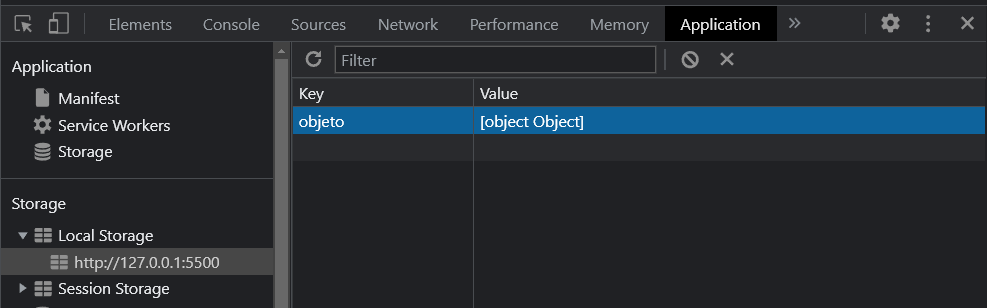
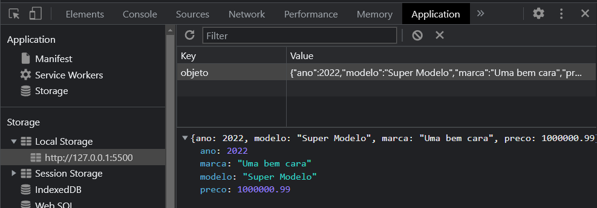
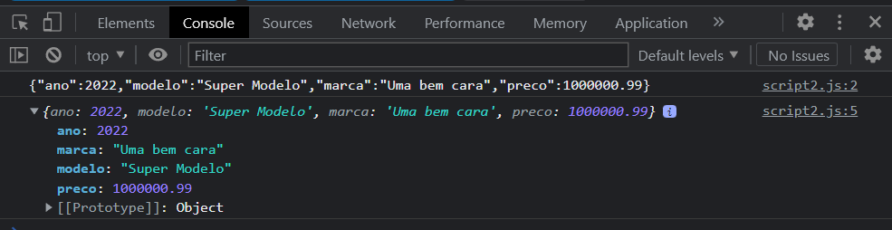
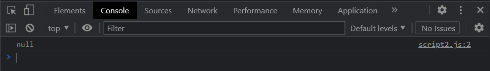
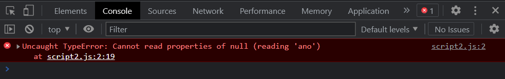

# Javascript II - Manipulando elementos

Nesta parte, utilizaremos os poderes do `Javascript` para manipular as nossas páginas através do **DOM (Document Object Model)**.

O **DOM** é uma representação da nossa página `HTML` em forma de **documento**, essa representação nos permite acessar e manipular elementos e estilos existentes na página de forma hierárquica. Por exemplo:


```
- Página 
    - corpo da página (body)
        - título da página (h1)
        - um parágrafo qualquer (p)
        - um lista (ul ou ol)
            - primeiro item da lista (li)
            - segundo item da lista (li)
            - ...
        ...
```

Para mais detalhes sobre o DOM [clique aqui](https://developer.mozilla.org/pt-BR/docs/Web/API/Document_Object_Model/Introduction).

## Tabela de conteúdos
* [Acessar a página](#acessar-a-página)
* [Obter elementos da tela](#obter-elementos-da-tela)
* [Obter os valores do elementos](#obter-os-valores-do-elementos)
    * [Input](#input)
    * [Outros elementos](#outros-elementos)
* [Adicionar elementos simples na tela](#adicionar-elementos-simples-na-tela)
* [Adicionar elementos complexos na tela](#adicionar-elementos-complexos-na-tela)
* [Navegando entre telas](#navegando-entre-telas)
* [Navegando entre telas e usando form](#navegando-entre-telas-e-usando-form)
* [Salvando as informações](#salvando-as-informações)
* [Salvando objetos](#salvando-objetos)
    * [JSON](#json)
    * [Alguns cuidados](#alguns-cuidados)
* [Consumindo APIs](#consumindo-apis)
    * [Get](#get)
    * [Post](#post)

## Acessar a página
Para acessar a página como um todo utilizamos o comando `document` no Javascript.

A partir daí, podemos incluir um ponto `.` e explorar opções como:

```javascript
// Acessar o body da página

var body = document.body;
```

```javascript
// Criar um novo elemento em memória
// Basta informar o nome da tag do elemento que queremos criar, como: h1, h2, p, img, etc...

var elemento = document.createElement("input");
```

```javascript
// Obter um elemento da página pelo ID
// No JS não é necessário utilizar o # ao informar o ID do elemento como fazemos no CSS.

var elemento = document.getElementById("id_do_elemento");
```

```javascript
// Obter um elemento pelo nome da tag, class, type, etc...

var elemento = document.querySelector("li");

//ou

var elemento = document.querySelector("input[type='button']");
```

Entre outras opções.

## Obter elementos da tela
Uma coisa muito importante que precisaamos entender e que é bastante comum que a gente se confunda no começo é que quando obtemos um elemento da tela usando qualquer uma das abordagens mostradas acima, seja `getElementyById` ou `querySelector`, é que estamos **"pegando" o elemento inteiro, com todos os seus atributos e não apenas o valor dele**.

Imagine o seguinte caso, na sua tela existe um `input` onde o usuário deve digitar o nome e um botão que deve mostrar o valor digitado num `alert` ao ser clicado:
```html
<input type="text" id="nome_do_usuario">
```

No começo é batante comum fazermos:
```javascript
var elemento = document.getElementById("nome_do_usuario");
alert(elemento); // coloca o elemento diretamente no alert pensando que está mostrando o valor
```

No exemplo acima, a nossa variável `elemento` está armazenando um `elemento HTML` inteiro, um `input` do tipo `text` e não apenas o valor digitado pelo usuário. Ao mostrar essa mensagem teremos algo como `<HTML Element>` mostrado na tela ou algo do tipo.

Devido ao fato de a variável `elemento` ser um elemento `HTML` completo, podemos acessar e até modificar qualquer um dos seus atributos como `id`, `style`, `type`, etc.

## Obter os valores do elementos
Como vimos acima, apenas mostrar a variável `elemento` não vai funcionar, para obter e mostrar o valor precisamos utilizar o **atributo** correto. E agora precisamos ter bastante cuidado, pois o atributo correto vai depender de qual elemento HTML você está utilizando, por exemplo:

### Input
**Todos os `inputs`**, independente de ser um botão ou um campo de texto, tem o seu valor na propriedade `value` e para acessá-lo, uma vez que o elemento já esteja em uma variável, basta:

```html
<input type="text" id="nome_do_aluno">
```
```javascript
var nomeDoAluno = document.getElementById("nome_do_aluno");
alert(nomeDoAluno.value); // assim realizamos a leitura do valor armazenado no atributo value do input
```

**Atenção**: As vezes o `VSCode` não reconhece o `value` como um comando possível, mesmo estando tudo certo. Por isso, se o elemento que você está trabalhando é um `input`, pode usar o `value` sem problema, só fique atento para não acabar escolhendo alguma das sugestões do `VSCode` sem querer.

### Outros elementos
Outros elementos `HTML` como parágrafos(`p`), títulos(`h1`, `h2`, `h3`, etc), itens de lista(`li`), entre outros; não possuem a propriedade `value`. Nesses casos podemos utilizar o `innerHTML` ou `innerText`.

```html
<p id="texto_qualquer">Um parágrafo contendo qualquer coisa.</p>
```
```javascript
var paragrafo = document.getElementById("texto_qualquer");
alert(paragrafo.innerHTML); 
// ou
alert(paragrafo.innerText);
```

O **inner** significa interno(a) em inglês e significa exatamente:
- `innerHTML` = *HTML interno* e
- `innerText` = *Texto interno*


Agora você pode estar se perguntando: *Mas por que interno? Está dentro do que?*

E a resposta é bem simples, quando utilizamos algum dos **"inners"** queremos tudo que está dentro do elemento, entre a tag de abertura dele e a de fechamento:
```html
<p>Tudo isso aqui que está dentro do elemento é o innerHTML e o innerText</p>
```

A diferença entre os dois é que um se interessa por todo o conteúdo `HTML` existente dentro do elemento, inclusive outras tags e o outro só considera os textos, então se tivermos a seguinte situação:

```html
<!-- A palavra "qualquer" está em negrito -->
<p id="texto_qualquer">Um parágrafo contendo <strong>qualquer</strong> coisa.</p>
```
```javascript
var paragrafo = document.getElementById("texto_qualquer");

// aqui o resultado será: Um parágrafo contendo <strong>qualquer</strong> coisa.
alert(paragrafo.innerHTML); 

// o resultado será: Um parágrafo contendo qualquer coisa.
alert(paragrafo.innerText);
```

## Adicionar elementos simples na tela
...

## Adicionar elementos complexos na tela
...

## Navegando entre telas
Realizar a navegação de uma página para outra via `Javascript` é bastante simples, utilizarmos o comando `window.location.href` e passar o caminho da próxima página.

Por exemplo, no nosso site temos duas páginas: `pagina1.html` e `pagina2.html`. 

```
- projeto 
    - pagina1.html
    - pagina2.html
```

Ambas estão no mesmo nível e em cada uma delas existe um botão que direcionará para a outra página.

```html
<input type="button" value="Ir para página 2" onclick="navegarParaPagina2()">
```

```javascript
function navegarParaPagina2() {
    window.location.href = "pagina2.html";
}
```

No exemplo acima passamos apenas o nome do arquivo `HTML` pois ambas as páginas estão no mesmo nível, porém, se as páginas estiverem em subpastas ou níveis diferentes precisaremos detalhar o caminho:

```
- projeto 
    - pasta1
        - pagina1.html
    - pagina2.html
```

Agora com uma configuração de pastas um pouco diferente temos duas formas diferentes para navegar:

**Página 1 para Página 2**
```javascript
function navegarParaPagina2() {
    window.location.href = "../pagina2.html";
}
```

O `../` é utilizado para voltar um nível, pois a `pagina1.html` está dentro da `pasta1` e voltando um nível estaremos na pasta `projeto` onde existe a `pagina2.html`.

**Página 2 para Página 1**
```javascript
function navegarParaPagina1() {
    window.location.href = "pasta1/pagina1.html";
}
```

Neste caso a navegação pode ser feita diretamente, sem usar o `../`, pois a `pasta1` está no mesmo nível da `pagina2.html` que é onde estamos.

## Navegando entre telas e usando form
...

## Salvando as informações
Para salvar informações em uma espécie de "banco de dados" local do navegador podemos utilizar o **Local Storage**. É um recurso disponível nos navegadores que nos permite armazenar **informações de texto** que podem ser acessadas posteriormente, após atualizações de tela ou até mesmo quando o navegador é fechado.

Para acessarmos o **Local Storage** basta utilizarmos o comando `localStorage` e todo o nosso uso será através de duas funções principais: `setItem()` e `getItem()`.

```javascript
localStorage.setItem("nomeDaChave", "valor que está sendo guardado");
```

Como pode ser visto acima, o **Local Storage** funciona no modo **chave e valor**, similar as nossas variáveis, e utilizamos a função `setItem` para armazenar o valor com a chave informada. Assim como as variáveis, a chave não pode ter espaços, caracteres especiais ou acentos (simplicidade). 

**Importante ¹**: A chave também não pode ser repetida, na verdade se uma chave já existente for informada o valor da anterior será perdido. 

**Importante ²**: As chaves são separadas por `URL` do site, porém, como usamos o `live-server` para auxiliar nossos desenvolvimentos todas as nossas `URLs` acabam ficando iguais: `http://127.0.0.1:5500`. Por isso tome cuidado, pois se estiver desenvolvendo dois projetos ao mesmo tempo e utilizar chaves iguais, um vai sobrescrever o valor do outro.

**Importante ³**: As chaves ficam disponíveis para todas as páginas dentro de um mesmo site.

Para conferirmos se ficou tudo certo, podemos abrir a área de inspeção do navegador, ir na aba **Application**, achar a área de **Storage**, expandir o **Local Storage** e escolher a nossa `URL` local.

<P align="center">
    
</p>

Agora que já conferimos e nossa chave está lá, podemos usar a outra função `getItem()` para recuperar o valor armazenado sempre que for necessário.

```javascript
// Para obter o valor armazenado, basta informar a chave
var valor = localStorage.getItem("nomeDaChave");
```

### Referências
1. https://developer.mozilla.org/pt-BR/docs/Web/API/Window/localStorage

## Salvando objetos
Como vimos acima o **Local Storage** só guarda `string`, mas e se o conteúdo que queremos armazenar não for uma `string`, e se for um `array` ou um `objeto complexo`?

Veja o seguinte exemplo:

```javascript
var carro = {
    ano: 2022,
    modelo: "Super Modelo",
    marca: "Uma bem cara",
    preco: 1000000.99
};

localStorage.setItem("objeto", carro);
```

Ao executarmos o código acima veremos que o resultado não foi bem o que a gente esperava. Isso acontece porque a minha variável `carro` é um `objeto complexo` e não uma `string`.

<P align="center">
    
</p>

Existe uma forma de "roubar" e conseguir utilizar o **Local Storage** mesmo para `arrays` ou `objetos complexos`, estou falando do `JSON`.

### JSON
`JSON` é uma sigla para **Javascript Object Notation** ou simplesmente **Notação de Objetos do Javascript**. É uma forma de escrever objetos complexos, mas como texto, pois todo `JSON` sempre é uma `string`.

Sendo assim, o valor da variável `carro` como `JSON` é:

```json
{
    "ano": 2022,
    "modelo": "Super Modelo",
    "marca": "Uma bem cara",
    "preco": 1000000.99
}
```

Perceba que a estrutura é a mesma utilizada no Javascript, com a única diferença que **as propriedades estão todas entre aspas**.

E para converter qualquer objeto complexo ou array em JSON basta utilizarmos o comando `stringify()`:

```javascript
// O comando stringify transforma o que for passado como parâmetro em uma string no formato JSON.
var carroJSON = JSON.stringify(carro);
```

Deste modo, podemos substituir a nossa solução de escrita no `Local Storage` por:

```javascript
var carro = {
    ano: 2022,
    modelo: "Super Modelo",
    marca: "Uma bem cara",
    preco: 1000000.99
};

// Converte o objeto em JSON e salva no Local Storage em passos separados
var carroJSON = JSON.stringify(carro);
localStorage.setItem("objeto", carroJSON);

// Ou simplesmente converte e salva na mesma linha
localStorage.setItem("objeto", JSON.stringify(carro));
```

Conferindo no inspetor de elementos do navegador as coisas parecem estar fazendo sentido:

<P align="center">
    
</p>

Da mesma forma que **transformamos** o nosso `objeto complexo` em `JSON` para gravar no **Local Storage**, precisamos transformá-lo de volta em `objeto complexo` quando fizermos a leitura do `Local Storage` através do `getItem()`. Para fazer isso utilizaremos a função `parse()` do `JSON`.

```javascript
// Obtém o valor armazenado no Local Storage
var carroJSON = localStorage.getItem("objeto");
console.log(carroJSON);

// Converte o valor obtido de JSON para Objeto
var carro = JSON.parse(carroJSON);
console.log(carro);
```

Utilizei o `console.log()` para imprimir os valores das duas variáveis e notarmos as diferenças. Vejam que na primeira linha todo o conteúdo está como `string` e na segunda temos o nosso `objeto carro` de volta.

<P align="center">
    
</p>

```javascript
// Podemos simplesmente obter o valor do Local Storage e 
// já converter para objeto em uma mesma linha
var carro = JSON.parse(localStorage.getItem("objeto"));
console.log(carro);
```

### Alguns cuidados
Quando tentamos obter uma chave do **Local Storage** e a mesma não existe, **nenhum erro ocorre**, porém ao convertermos para objeto o resultado será `null`, pois não há o que ser convertido.

```javascript
var carro = JSON.parse(localStorage.getItem("objeto"));
console.log(carro);
```

Se não houver a chave `objeto` no **Local Storage**, nenhum problema ocorrerá e o resultado será:

<P align="center">
    
</p>

Porém se tentarmos ler alguma propriedade deste objeto teremos um erro:

```javascript
var carro = JSON.parse(localStorage.getItem("objeto"));
console.log(carro.ano);
```

Neste caso, como a variável `carro` tem o valor `null` a propriedade `ano` não existe, veremos o erro mostrado abaixo:

<P align="center">
    
</p>

## Consumindo APIs
...

### Get
...

### Post
...