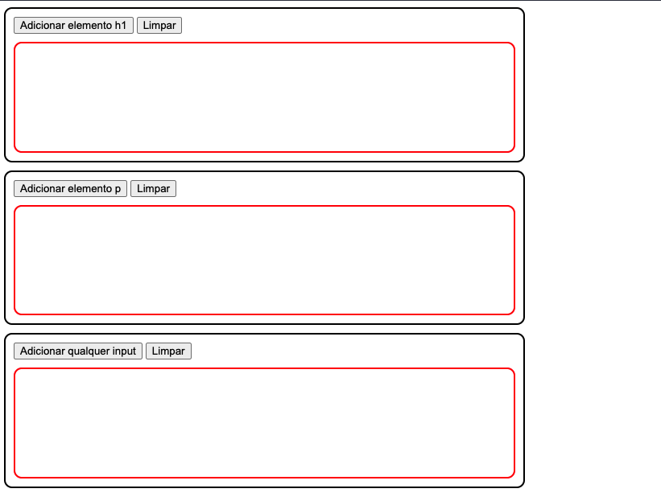

# Exercício - Adicionar elementos simples

Neste exercício existem 3 grandes áreas com borda preta, cada uma com 2 botões e uma área interna com borda vermelha (não se preocupe, você receberá o `HTML` e o `CSS` referentes ao layout já prontos).

Seu objetivo é implementar as funcionalidades de cada um destes botões.  
Por área serão dois:
1. O primeiro para adicionar um novo elemento na área vermelha correspondente
2. O segundo para limpar todo o conteúdo da área vermelha correspondente

O `CSS` é bastante simples e já está totalmente pronto, se quiser avaliá-lo fique à vontade.

O `HTML` está praticamente pronto, mas você vai notar que alguns eventos estão faltando, é necessário corrigir.

O `JS` até tem alguma coisa, mas aqui precisaremos trabalhar um pouco mais para fazer funcionar.

<P align="center">
    
</p>

## Arquivos do projeto:
Copie os conteúdos abaixo e cole nos arquivos do seu projeto para facilitar. 

Cuidado com os nomes dos arquivos ao referênciar o `CSS` e o `JS` a partir do `HTML`. 

### estilo.css
```css
.area_exercicio {
  width: 75vw;

  border-style: solid;
  border-width: 2px;
  border-radius: 10px;

  padding: 10px;
  margin-bottom: 10px;
}

#area_h1,
#area_p,
#area_input {
  min-height: 20vh;

  border-color: red;
  border-style: solid;
  border-width: 2px;
  border-radius: 10px;

  margin-top: 10px;
}
```

### pagina.html
```html
<!DOCTYPE html>
<html lang="pt-br">

<head>
  <meta charset="UTF-8">
  <meta http-equiv="X-UA-Compatible" content="IE=edge">
  <meta name="viewport" content="width=device-width, initial-scale=1.0">
  <title>Adicionar elementos na tela</title>
  <link rel="stylesheet" href="estilo.css">
</head>

<body>
  <div class="area_exercicio">

    <input type="button" value="Adicionar elemento h1" onclick="adicionarH1()">
    <input type="button" value="Limpar">

    <div id="area_h1">

    </div>
  </div>

  <div class="area_exercicio">
    <input type="button" value="Adicionar elemento p">
    <input type="button" value="Limpar">

    <div id="area_p">

    </div>
  </div>

  <div class="area_exercicio">
    <input type="button" value="Adicionar qualquer input" onclick="">
    <input type="button" value="Limpar" onclick="limparInput()">

    <div id="area_input">

    </div>
  </div>

  <script src="comportamento.js"></script>
</body>

</html>
```

### comportamento.js
```javascript
function adicionarH1() {
}

function adicionarP() {
}

function limparInput() {
}

```