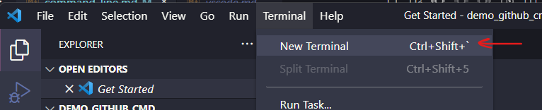
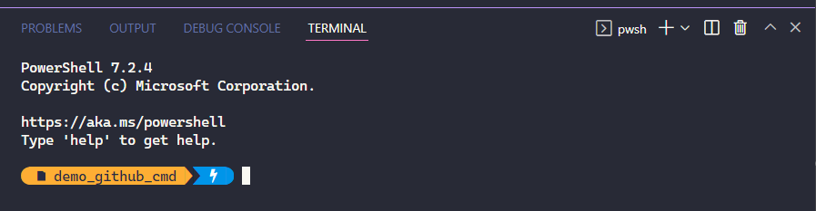
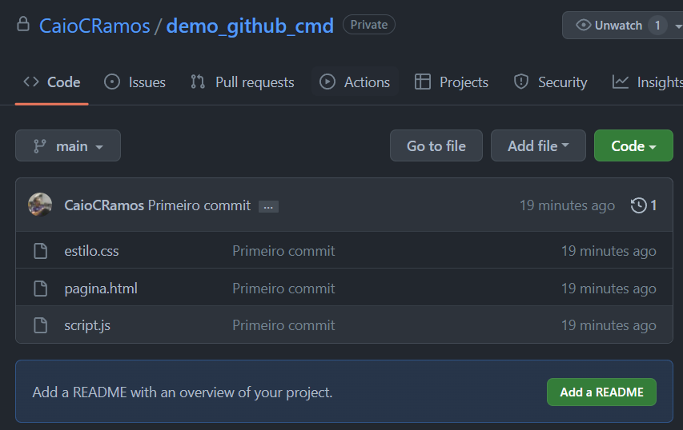

# Usando **Git** por linhas de comando

## Tabela de conteúdos

* [Introdução](#introdução)
* [Quando já temos o código na nossa máquina](#quando-já-temos-o-código-na-nossa-máquina)
    * [Inicializar um repositório](#inicializar-um-repositório)
    * [Adicionar arquivos existentes](#adicionar-arquivos-existentes)
    * [Primeiro commit](#primeiro-commit)
    * [Identificando o destinatário](#publicando-o-commit)
    * [Publicando o commit](#publicando-o-commit)
* [Referências](#referências)

## Introdução

Para utilizar o **Git** por linhas de comando você precisará abrir um terminal ou prompt de comando do seu sistema, seja ele Windows, Linux ou Mac.

Adicionalmente, pode-se utilizar também o terminal existente dentro do **VSCode**. Para abrir basta no menu superior do **VSCode**, clicar na opção Terminal e em seguida New Terminal ou Novo Terminal.

<P align="center">
    
</p>

Gosto desta opção pois nos permite trabalhar com o **Git** na mesma tela em que estamos trabalhando com o nosso código.

O terminal do **VSCode** normalmente abre na parte inferior da tela.

<P align="center">
    
</p>

## Quando já temos o código na nossa máquina

Quando já temos alguma coisa escrita do nosso projeto salvo no nosso PC, precisamos fazer o processo de iniciar essa nossa pasta como um repositório do **Git**.

Para isso eu abri no **VSCode** o meu projeto de exemplo `demo_github_cmd`, nele existem apenas 3 arquivos bem simples:
- `estilo.css`
- `pagina.html`
- `script.js`

### Inicializar um repositório

Agora que já estou com meu projeto aberto no **VSCode**, preciso abrir o Terminal, como já mostrado acima e digitar:

```
git init
```

Esse comando é responsável por iniciar um repositório **Git** e se tudo der certo uma mensagem como a seguir deve ser mostrada:

```
Initialized empty Git repository in C:/Users/caioc/Desktop/demo_github_cmd/.git/
```

### Adicionar arquivos existentes
Se o seu projeto ainda estiver vazio, você não precisa se preocupar com esse passo agora, no entanto se já houver ou assim que houver algum arquivo no seu projeto você precisará executar esta etapa.

Como dito no começo, existem 3 arquivos no meu projeto e executarmos o comando `git status` veremos o seguinte resultado:

```
On branch master

No commits yet

Untracked files:
  (use "git add <file>..." to include in what will be committed)
        estilo.css
        pagina.html
        script.js

nothing added to commit but untracked files present (use "git add" to track)
```

Basicamente a mensagem diz que existem 3 arquivos no projeto que ainda não estão sendo "observados" pelo **Git**. Para inclui-los devemos executar o comando:

```
git add .
```

O `.` informado significa que queremos dicionar todos os arquivos, se quisermos adicionar um arquivo de cada vez basta usarmos o mesmo comando, informando qual arquivo queremos adicionar, por exemplo:

```
git add estilo.css pagina.html script.js
```

No exemplo acima adicionei os mesmos 3 arquivos, porém informando-os 1 de cada vez separados por espaço. Após adicionarmos os 3 arquivos e usarmos novamente o comando `git status` veremos: 

```
On branch master

No commits yet

Changes to be committed:
  (use "git rm --cached <file>..." to unstage)
        new file:   estilo.css
        new file:   pagina.html
        new file:   script.js
```

Ao utilizar o `git add` estamos "empacotando" as modificações que queremos enviar para o **Github**, como se fosse um presente que queremos enviar para alguém.

### Primeiro commit
Assim que todos os arquivos desejados estiverem "dentro do pacote", podemos fechar e selar o pacote, para isso usaremos o comando `git commit`:

```
git commit -m "Primeiro commit"
```

O parâmetro `-m` é utilizado quando queremos informar uma mensagem no `commit` e no geral queremos fazer isso, esta mensagem é o título do nosso `commit` e serve como identificação. Dê preferência para mensagens simples e objetivas.

Após o commit um resultado similar ao seguinte deve ser mostrado:

```
[master (root-commit) b80e938] Primeiro commit
 3 files changed, 15 insertions(+)
 create mode 100644 estilo.css
 create mode 100644 pagina.html
 create mode 100644 script.js
```

### Identificando o destinatário
Agora que nosso pacote está criado com as modificações que escolhemos e devidamente lacrado, podemos prosseguir para o envio. Mas primeiro precisaremos identificar o destinatário, ou seja, para onde enviaremos este código.

Para isso você precisará primeiro ir até sua conta no **Github** e criar um novo repositório, tanto faz se Público ou Prívado. O nome também pode variar, no entanto recomendo utilizar o mesmo nome do projeto que está editando no **VSCode**, para facilitar. 

Assim que o repositório estiver criado, você terá em mãos uma URL, no meu caso, criei o repositório demo_github_cmd e recebi a seguinte URL:
```
https://github.com/CaioCRamos/demo_github_cmd.git
```

Agora, para informar ao **Git** que queremos enviar nosso código para o repositório recém criado em nossa conta basta utilizar o comando `git remote add origin` informando a URL do nosso projeto:

```
git remote add origin https://github.com/CaioCRamos/demo_github_cmd.git
```

E alterando o nome da nossa `branch` padrão de `master` para `main`:

```
git branch -M main
```

### Publicando o commit
Se fosse uma encomenda de verdade provavelmente teríamos que ir até uma agência de um serviço de postagem, aqui é um pouco mais simples, podemos fazer o nosso envio através do `git push`.

```
git push -u origin main
```

Se tudo deu certo, você receberá uma mensagem similar a mensagem abaixo:

```
Enumerating objects: 4, done.
Counting objects: 100% (4/4), done.
Delta compression using up to 12 threads
Compressing objects: 100% (3/3), done.
Writing objects: 100% (4/4), 456 bytes | 456.00 KiB/s, done.
Total 4 (delta 0), reused 0 (delta 0), pack-reused 0
To https://github.com/CaioCRamos/demo_github_cmd.git
 * [new branch]      main -> main
branch 'main' set up to track 'origin/main'.
```

Isso significa que a partir de agora todo o seu código já está na sua conta no **Github**.

<P align="center">
    
</p>

## Referências 

- [Git-guides](https://github.com/git-guides/) - Material oficial do **Github** sobre os principais comandos em inglês.