# Usando **Git** no **VSCode**

## Tabela de conteúdos

* [Introdução](#introdução)
* [Quando já temos o código na nossa máquina](#quando-já-temos-o-código-na-nossa-máquina)
    * [Inicializar um repositório](#inicializar-um-repositório)
    * [Primeiro commit](#primeiro-commit)
    * [Publicando o commit](#publicando-o-commit)
* [Quando já temos um repositório no Github](#quando-já-temos-um-repositório-no-github)
    * [Clonando um repositório](#clonando-um-repositório)
* [Baixando as atualizações do repositório](#baixando-as-atualizações-do-repositório)
* [Fazendo o commit de novas atualizações](#fazendo-o-commit-de-novas-atualizações)
* [Enviando as novas atualizações](#enviando-as-novas-atualizações)

## Introdução
Assim que instalamos o **Git** na nossa máquina, passa a ficar disponível no **VSCode** uma nova opção de menu chamada de `Source Control` ou `Controle de Código`.

    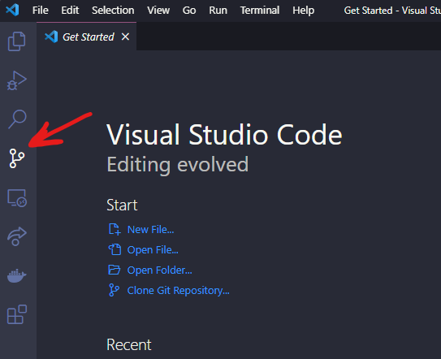

É por ela que gerenciaremos o nosso código, acompanhando, confirmando e desfazendo mudanças. Inicialmente, enquanto ainda não estamos com nosso projeto aberto no **VSCode**, as opções mostradas são:

    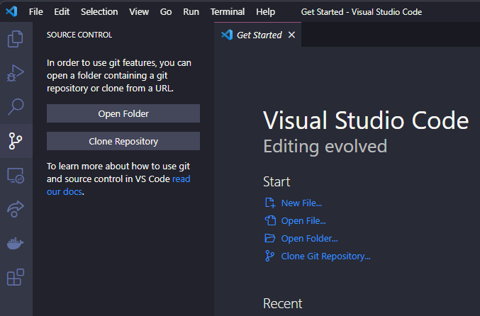

A opção `Open Folder` ou `Abrir pasta` nós já conhecemos, é a mesma que temos no menu do **VSCode** e através dela podemos escolher qual pasta queremos abrir para trabalhar no **VSCode**.

Já a opção `Clone Repository` ou `Clonar Repositório` é nova e falaremos sobre ela em instantes.

Existem duas formas básicas de começar a usar o **Git** em nossos projetos, quando já temos algum código escrito na nossa máquina ou quando o código ou até mesmo um repositório vazio está no **Github**.

## Quando já temos o código na nossa máquina

Quando já temos alguma coisa escrita do nosso projeto salvo no nosso PC, precisamos fazer o processo de iniciar essa nossa pasta como um repositório do **Git**.

Para isso eu abri no **VSCode** o meu projeto de exemplo `demo_github`, nele existem apenas 3 arquivos bem simples:
- `estilo.css`
- `pagina.html`
- `script.js`

### Inicializar um repositório
Agora que estamos com nosso projeto de exemplo aberto no **VSCode**, podemos abrir o `Source Control` e veremos opções diferentes disponíveis:

    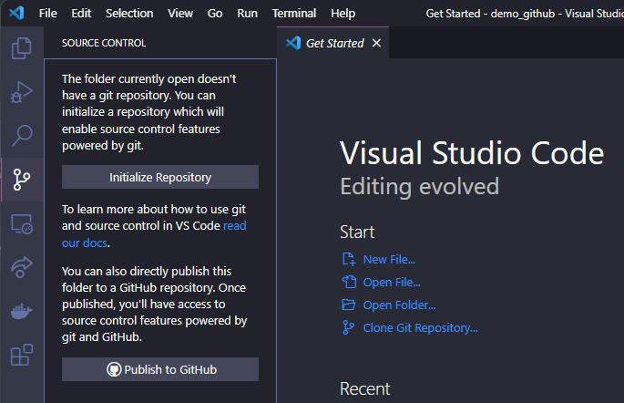

Nesse momento, ambas fazem a mesma coisa, que é inicilizar o nosso projeto como um repositório do **Git** e posteriomente enviar para nossa conta no **Github**. A única diferença é que a opção `Publish to Github` faz tudo de forma mais direta, omitindo alguns passos e a opção `Initialize Repository` nos permite visualizar cada etapa do processo e é por este caminho que seguiremos.

Ao clicar na opção `Initialize Repository`, nosso projeto será inicializado como um repositório **Git**, ou seja, qualquer modificação nos conteúdos começará a ser observada e gerenciada pelo **Git**. De cara vemos que nossos 3 arquivos foram adicionados na área de mudanças ou `Changes`. Isso acontece pois como nosso projeto passou a ser um repositório do **Git** neste exato momento, tudo que existia lá é considerado como algo novo.

    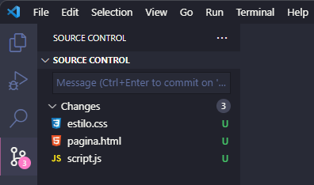

Nesta área, ao lado do nome de cada um dos nossos arquivos existem opções para `ver o arquivo`, `desfazer as mudanças` ou `confirmá-las`.

    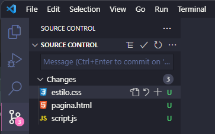

### Primeiro commit
Ao confirmar as mudanças de todos os arquivos, os mesmo sáo movidos para uma próxima área chamada de `Staged Changes`. Nesse momento, nossos arquivos estão prontos para serem enviados para a nossa conta no **Github**.

    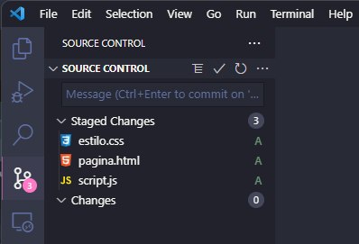

Nesta área também existem opções nos arquivos, podemos ver o arquivo ou remover a confirmação de mudanças, o que fará o arquivo voltar para a área anterior de `Changes`.

    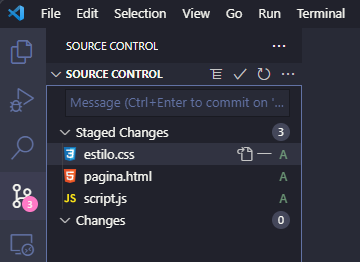

Agora que todos nossos arquivos estão confirmados, precisamos fazer o nosso `commit`, que nada mais é do que o "empacotamento" das nossas mudanças. Esse pacote é composto por basicamente 2 coisas, uma mensagem de identificação e os arquivos que estão sendo enviados.

    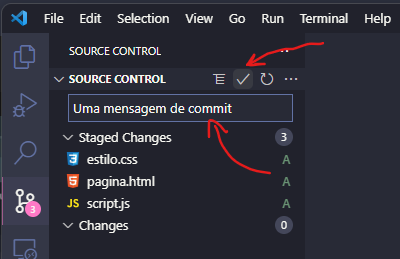

Após clicarmos na opção para confirmar o nosso `commit` nosso "pacote de mudanças" está pronto, lacrado e identificado, como uma encomenda que pretendemos enviar para alguém, porém, assim como uma encomenda, ainda precisamos executar o último passo. 

### Publicando o commit
Se fosse uma encomenda de verdade provavelmente teríamos que ir até uma agência de um serviço de postagem, aqui é um pouco mais simples, podemos fazer o nosso envio através do botão `Publish Branch` ou `Publicar`.

    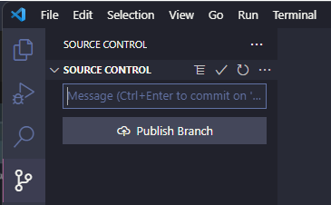

Para conseguir publicar precisamos de duas coisas, a primeira é escolher o nome do nosso repositório no **Github**, por padrão um campo de texto será mostrado no topo do **VSCode** e já virá preenchido com o nome atual da pasta do seu projeto, mudar este valor é opcional.

A segunda parte **só vai acontecer na primeira vez que você estiver tentando conectar o **VSCode** a sua conta no Github**, pois para que o **VSCode** consiga se comunicar com a nossa conta é necessário autorizar. Para isso será mostrada uma mensagem na tela pedindo essa autorização, ao clicar no botão `Allow` ou `Permitir`, seremos redirecionados para o nosso Navegador padrão e para a página do **Github**. 

Se já estivermos logados, uma tela pedido permissão para o **VSCode** se conectar a nossa conta será mostrada, se não, primeiro teremos que realizar o Login e então seremos questionados sobre a permissão.

    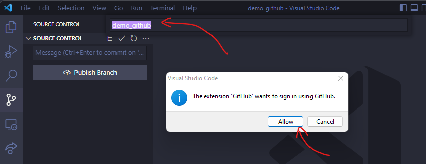

Uma vez que tudo seja autorizado, seremos redirecionados ao **VSCode** para finalizar a nossa publicação. Para isso basta escolher se nosso novo repositório será público ou prívado e a ação de publicação será concluída. 

    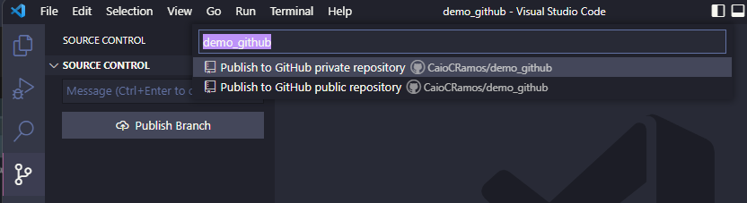

Um novo repositório será criado na nossa conta no **Github** já contendo todo o nosso código.

    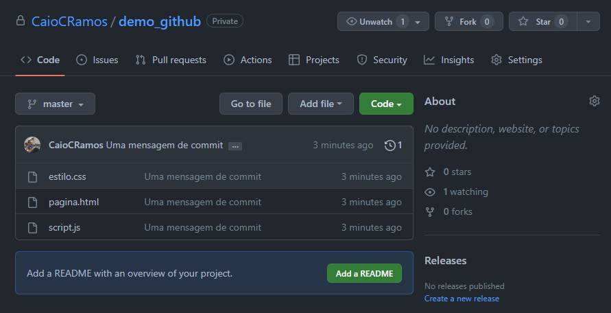

## Quando já temos um repositório no Github
Como dito no começo, podemos partir de um repositório ja criado na nossa conta no **Github**. Para isso precisamos abrir o **VSCode** e sem nenhum projeto aberto ir até `Source Control` (como mostrado na [introdução](#introdução)) e escolher a opção `Clone Repository` ou `Clonar Repositório`.

### Clonando um repositório
`Clonar` um repositório nada mais é do que baixar o repositório do **Github** para a nossa máquina. É muito comum fazermos isso quando vamos alterar um projeto que já existe e conta com bastante código, mas também para projetos novos e que ainda não possuem nenhum arquivo.

A vantagem de se `clonar` um repositório é que o mesmo já vem inicializado e não é necessário realizar o passo de [inicialização](#inicializar-um-repositório) descrito acima. Assim como qualquer mudança feita em arquivos novos ou pré-existentes já estará sendo observada e gerenciada pelo **Git**.

Ao escolher a opção `Clone Repository` do `Source Control` veremos a seguinte opção no topo do **VSCode**.

Ao clicar em `Clone from Github` ou `Clonar do Github` serão listados todos os repositórios disponíveis na sua conta. 

**Atençao:** assim como na etapa de [publicação do commit](#publicando-o-commit) descrita acima, **se for a primeira vez que você estiver tentando conectar o **VSCode** a sua conta no Github**, ele solicitará uma autorização para que consiga se comunicar com a nossa conta. Para isso será mostrada uma mensagem na tela pedindo essa autorização, ao clicar no botão `Allow` ou `Permitir`, seremos redirecionados para o nosso Navegador padrão e para a página do **Github**. 

Se já estivermos logados, uma tela pedido permissão para o **VSCode** se conectar a nossa conta será mostrada, se não, primeiro teremos que realizar o Login e então seremos questionados sobre a permissão. 

Basta selecionar o repositório desejado e escolher em qual pasta da sua máquina o download será feito. Será criada uma pasta na sua máquina com o mesmo nome do repositório na sua conta do **Github**, neste exemplo estou clonando o repositório `demo_github` (o mesmo criado no [fluxo anterior](#quando-já-temos-o-código-na-nossa-máquina)).

    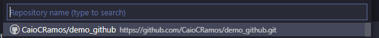

Por último, assim que o download do repositório estiver concluído o **VSCode** perguntará se já queremos abrir esta pasta, escolha a opção `Open` ou `Abrir` para facilitar.

    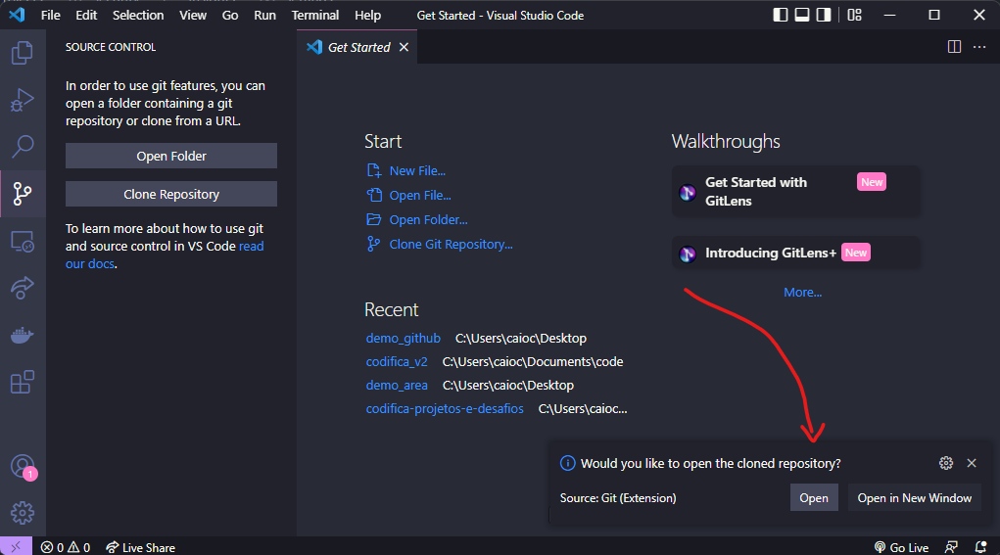

Agora o nosso repositório já está baixado, aberto e pronto para ser trabalhado em nosso **VSCode**.

Se por algum motivo não selecionamos a opção de abrir o repositório mostrada acima, ou simplesmente fechamos o **VSCode** para continuar em outro momento, basta realzarmos o fluxo padrão de `Open folder` ou `Abrir pasta` e escolher a pasta do nosso repositório no caminho que escolhemos para cloná-lo.

## Baixando as atualizações do repositório
Uma boa prática quando estamos trabalhando com outras pessoas no mesmo repositório é sempre antes verificar se existe alguma atualização disponível para ser baixada antes de começar uma nova modificação.

Para isso basta acessar a área de `Source Control`, clicar nos `...` e utilizar a funcionalidade de `Pull`.

    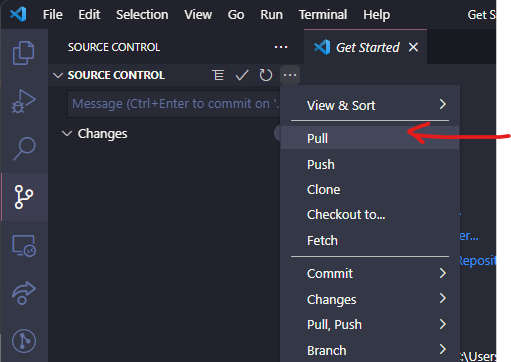

Fazendo isso, toda atualização de código que ainda não consta na sua cópia local do repositório será baixada.

## Fazendo o commit de novas atualizações
O processo de fazer commits de novas atualizações é o mesmo descrito anteriormente em [primeiro commit](#primeiro-commit). A única diferença é que agora apenas os arquivos modificados serão listados na área de `Modificações` ou `Changes`.

Suponha que eu alterei o arquivo `pagina.html` que já existia mas estava vazio, incluí o `HTML` padrão e salvei.

O arquivo `pagina.html` será listado na área de modificações e se eu clicar nele, posso inclusive ver as modificações feitas. A esquerda é possível ver que ele estava vazio antes da minha modificação e a direita podemos ver como ele está atualmente.

    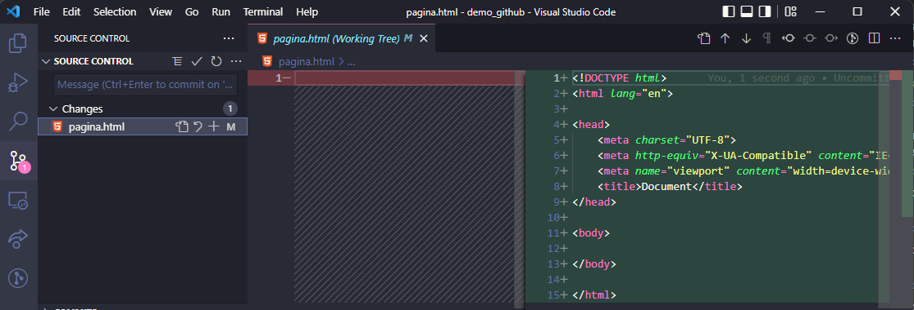

Assim como descrito em [primeiro commit](#primeiro-commit), se tudo estiver correto, basta confirmar a modificação do arquivo enviando-o para `Staged Changes`, inserindo uma mensagem de `commit`** clara e objetiva sobre a modificação** e finalizando a ação.

    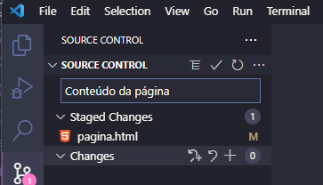

Neste momento, temos um "pacote" contendo um arquivo modificado e pronto para ser enviado.

## Enviando as novas atualizações
Assim como descrito em [publicando o commit](#publicando-o-commit), precisamos enviar este "pacote". Para fazer isso temos 2 alternativas:

1. Clicar em `Sync Changes` ou `Sincronizar modificações`
2. Ir nos `...` e escolher a opção `Push`.

    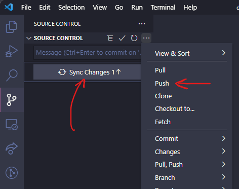

